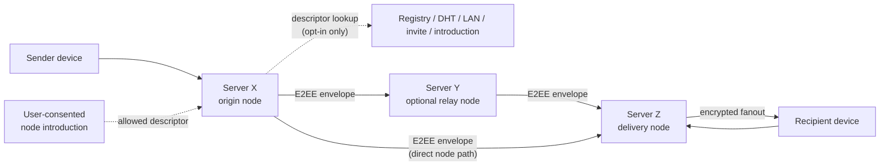

# Communication Networking Layer Plan

## Document Metadata

- Doc ID: communication-networking-layer-plan
- Owner: Architecture, core, API, and realtime maintainers
- Status: ready
- Scope: repository
- last_updated: 2026-05-11
- Source of truth: `docs/architecture/04-communication-networking-layer-plan.md`

## Quick Context

- Primary edit location for networking-layer architecture across E2EE DM envelope delivery and server communication.
- Keep this plan implementation-focused and avoid duplicating product policy rationale covered in product docs.
- Latest meaningful change: 2026-05-11 added recipient-targeted realtime dispatch summaries for DM encrypted envelopes while keeping final delivery ack-backed.

## Purpose

- Define one networking architecture for E2EE DM envelope delivery through server nodes/message nodes that participate in the server-node P2P network, plus client-to-node communication.
- Make shared policy, provenance, diagnostics, and profile-device convergence components explicit.
- Keep forbidden node-bypassing DM surfaces out of runtime, contracts, and product docs.
- Make server-node discovery, peering, relay, and delivery policy explicit enough that private, LAN-only, local-only, and public opt-in networks can all fit one model.

## Terminology Correction: No Primary Server Assumption

HexRelay is a Discord-like communication product. A user identity is not owned by, anchored to, or permanently assigned to a single primary server.

Users may:

- use one local desktop runtime only,
- join one or more privately hosted servers,
- use online servers that are not publicly discoverable,
- move between nodes over time,
- allow a server to discover or introduce other servers,
- refuse server-mediated discovery entirely.

Servers are runtime nodes in a policy-controlled P2P network. They may provide community hosting, profile synchronization, encrypted DM envelope delivery, discovery, relay, or only a subset of those roles. No routing, discovery, or trust rule should assume a permanent user-to-server ownership relationship.

## Policy and Boundary Inputs

- DM plaintext and private keys remain client/device-only.
- Server nodes/message nodes in the server-node P2P network may carry and store E2EE DM envelopes plus minimal delivery metadata only.
- Normal DM send success uses server-node P2P encrypted-envelope delivery.
- DM delivery must not use recipient-device LAN/WAN transport, endpoint hints/cards, pairing QR/manual-code bootstrap, connectivity preflight, WAN wizard, or parallel dial.
- Server communication remains client-to-node and can use operator-hosted server infrastructure; P2P participation is between server runtimes.
- No fallback may introduce server-readable DM content, private-key custody, or unencrypted DM mailbox/relay behavior.
- One profile may run on multiple devices; incoming communication must eventually converge to all profile devices, including devices that become active later.
- UX changes of any kind require explicit user approval before implementation.
- Node discovery, peering, relay, and delivery are separate permissions.
- Discovery is always opt-in from the server/node being discovered.
- A server may be online and still private, non-discoverable, non-relaying, or invite-only.
- A server may run only locally inside a LAN and refuse all external discovery.
- A server may refuse to relay DM envelopes even if it participates in discovery or peering.
- Users may introduce servers to other servers only when the introduced server explicitly permits that sharing and the user consents.
- Other servers may discover only nodes whose active descriptors allow that discovery path.

## Target Architecture

### Layered Model

1. **Communication Layer API**
   - Single high-level interface used by app features for DM send, channel send, and presence update.
   - Routes calls to the correct transport profile using policy rules.

2. **Session and Policy Engine**
   - Session lifecycle, auth provenance, policy checks, retry budget, and deterministic failure reasons.

3. **Delivery Diagnostics**
   - Node reachability, auth prerequisites, delivery-state diagnostics, and bounded reason codes.
   - Diagnostics must not imply node-bypassing DM transport.

4. **Transport Adapters**
   - `EncryptedEnvelopeNodeTransport` for server-node P2P DM ciphertext envelope accept/store/fanout/catch-up.
   - `NodeClientTransport` for server/channel APIs and realtime fanout.

5. **Payload Security and Reliability**
   - DM path uses E2EE payload semantics and ciphertext-only server handling.
   - Server path uses node-authoritative channel semantics.

6. **Profile-Device Sync Layer**
   - Per-profile device manifest and device key registry.
   - Per-device ack/sync cursor tracking.
   - Active-device fanout and late-device catch-up primitives.

## Server-Node P2P Interaction Model

The server-node network is a dynamic, policy-scoped graph. It is not a mandatory global federation, not a public-only network, and not a recipient-device or client-to-client DM transport.

Each node decides:

- whether it participates in any P2P behavior,
- whether it is discoverable,
- who may peer with it,
- whether it stores encrypted envelopes durably,
- whether it relays encrypted envelopes for other nodes,
- which users or memberships can use it as an ingress or delivery point.

The resulting graph can be as small as two private servers connected by an invite, a LAN-only cluster, a local-only desktop runtime with no peers, or a larger opt-in public discovery network.

### Node Roles

Roles are capabilities, not separate products. A single runtime can perform multiple roles at the same time.

- **Client device**: user-controlled app/runtime that owns private keys, decrypts DM content, signs user-level actions, and connects to one or more eligible server nodes. It is not used as a LAN/WAN DM transport hop for other users.
- **Origin node**: the server node that receives an outbound encrypted DM envelope from a sender device or local runtime. It validates sender authorization and starts delivery attempts. It does not own the sender identity.
- **Delivery node**: a server node eligible to accept an encrypted envelope for a recipient because the recipient has an account session, membership, accepted contact relationship, registered device route, or other approved delivery relationship there.
- **Relay node**: an intermediate server node that forwards encrypted envelopes between origin and delivery nodes when its policy allows it. It must not decrypt DM content and may choose transient-only handling.
- **Discoverable node**: a node whose signed descriptor may be returned by a discovery adapter or shared through a permitted introduction path.
- **Private node**: a node that is reachable only by explicit configuration, invitation, allowlist, or local network presence. Private nodes can still be hosted online.
- **Local-only node**: a runtime that refuses external discovery and peering. It may still serve local desktop features.
- **LAN-only node**: a node that may announce or accept peers on a local network but refuses WAN/public discovery.

### Capability And Policy Descriptor

Every node that participates beyond local-only operation should publish a short-lived signed descriptor to the peers or discovery scopes it has chosen.

The descriptor is the unit of discovery. Discovery systems must return descriptors, not implicit trust.

Minimum descriptor fields:

```text
node_id
node_public_key
descriptor_id
issued_at
expires_at
network_mode
discovery_policy
peering_policy
relay_policy
dm_forwarding_policy
storage_policy
addresses
supported_protocols
rate_limits
trust_labels
revocation_pointer
signature
```

Suggested policy values:

| Field | Values | Meaning |
| --- | --- | --- |
| `network_mode` | `offline`, `local_only`, `lan_only`, `private_peers`, `public_discovery` | Highest network exposure the node currently permits. |
| `discovery_policy` | `none`, `lan_announce`, `private_allowlist`, `member_visible`, `user_consented_introduction`, `public_registry`, `public_dht` | Where the descriptor can appear. |
| `peering_policy` | `none`, `static_allowlist`, `invite_token`, `member_introduced`, `public_authenticated` | Which remote nodes may attempt authenticated peering. |
| `relay_policy` | `none`, `own_users_only`, `allowlisted_peers`, `open_limited` | Whether the node forwards encrypted envelopes for other nodes. |
| `dm_forwarding_policy` | `disabled`, `local_recipients_only`, `allowlisted_route`, `relay_allowed` | Which encrypted DM envelope flows are accepted. |
| `storage_policy` | `transient_only`, `durable_encrypted_envelopes` | Whether encrypted envelopes can be queued durably. |

Descriptors must be:

- signed by the node identity key,
- short-lived,
- revocable,
- scoped to explicit discovery policies,
- safe to cache only until expiration,
- safe to share only when `discovery_policy` permits that path.

### Permission Separation

Participation is not all-or-nothing. These permissions must stay independent:

| Permission | What it allows | What it does not imply |
| --- | --- | --- |
| Discovery | Another node or user can learn that a node exists under an allowed scope. | Peering, relay, DM delivery, user membership, or trust. |
| Peering | Two nodes may maintain an authenticated node-to-node connection. | Relay permission or acceptance of user traffic. |
| Delivery | A node may accept encrypted envelopes for a recipient it can serve. | Permission to relay for unrelated nodes. |
| Relay | A node may forward encrypted envelopes between other nodes. | Ability to decrypt content or become a trusted user authority. |
| Storage | A node may queue encrypted envelopes according to policy. | Permanent retention, plaintext access, or unrestricted mailbox behavior. |

This separation is required so a server can be online but private, discoverable but non-relaying, peered but DM-disabled, or local-only with no external presence.

### Interaction Flow



High-level steps:

1. A node boots and loads its local policy.
2. If policy allows discovery, it creates a signed short-lived descriptor.
3. The descriptor is exposed only through enabled discovery adapters.
4. A sending client submits an encrypted DM envelope to an eligible origin node.
5. The origin node finds candidate delivery nodes through known peers, registries, allowlists, LAN discovery, or user-consented introductions.
6. Candidate nodes validate descriptors, expiration, signatures, revocation state, and policy compatibility.
7. The origin node chooses a direct delivery path when possible.
8. If direct delivery is unavailable and policy allows relay, the origin node selects one or more relay candidates.
9. Each relay node forwards only the encrypted envelope and minimal routing metadata.
10. The delivery node queues or fans out the encrypted envelope to recipient devices according to recipient authorization and storage policy.
11. Refusals are normal outcomes. The sender side receives retryable, blocked, or unavailable delivery state without exposing plaintext.

### Dynamic Private Networks

The model is intentionally dynamic. People and communities can create small P2P server networks without joining a global public system.

Supported shapes:

- **Local-only runtime**: no discovery, no peering, no relay.
- **LAN-only group**: nodes use local discovery and authenticated peering inside one network.
- **Private online mesh**: hosted servers exchange descriptors through static allowlists or signed invite tokens.
- **Member-visible cluster**: servers expose descriptors only to authenticated members.
- **User-introduced peering**: a user shares an allowed node descriptor from one server context to another, and both servers still independently accept or reject peering.
- **Public opt-in network**: nodes publish descriptors to a registry or future DHT.

This produces a graph where each node's local view may include:

- known node descriptors,
- trusted or allowlisted peers,
- active peer links,
- candidate delivery nodes,
- candidate relay nodes,
- blocked or revoked nodes,
- observed reliability and abuse signals.

No node needs a complete global view. Small private networks remain first-class.

### User-Consented Server Introductions

Users may help servers discover other servers, but only inside explicit consent and descriptor policy.

Rules:

- A user cannot make a hidden server globally discoverable.
- A user can share only a descriptor that permits `user_consented_introduction` or a narrower equivalent.
- The sharing action must be explicit in the product flow before implementation.
- The receiving server must validate the descriptor signature, expiration, revocation state, and share policy.
- The receiving server may reject the introduction for local policy, trust, rate-limit, or abuse reasons.
- The introduced server may still reject peering or DM delivery.
- Introductions should create candidate peers, not automatic trust.

Introduction payloads should contain only node-level descriptor data and consent metadata. They must not contain DM plaintext, private keys, hidden membership lists, or unrelated user social graph data.

### Refusal And Degraded Operation

Refusal is a core protocol state, not an error case.

Examples:

- A node refuses all discovery.
- A node accepts LAN discovery but refuses WAN peering.
- A node is discoverable through a registry but allows only allowlisted peers.
- A node accepts peering but refuses relay traffic.
- A node accepts relay traffic only for its own users or trusted peers.
- A node accepts encrypted envelopes but only transiently.
- A node refuses a user-consented introduction because the descriptor expired or local trust policy rejects it.

Delivery behavior should degrade in this order:

1. direct known delivery node path,
2. direct newly discovered delivery node path,
3. allowlisted relay path,
4. deferred retry with backoff,
5. user-visible unavailable/blocked state when product copy is approved.

No fallback may introduce recipient-device or client-to-client LAN/WAN DM transport.

## Networking Algorithms

HexRelay should use existing, well-understood distributed-system algorithms where they match the product constraints. The guiding rule is: use simple deterministic mechanisms first, then add decentralized algorithms only where they solve an actual scaling or resilience problem.

### Identity, Descriptors, And Authentication

Use:

- **Ed25519 node identity keys** for node identity and descriptor signatures.
- **Canonical signed descriptors** using a deterministic encoding such as canonical JSON or CBOR.
- **Short descriptor TTLs** plus revocation pointers to avoid stale topology data.
- **TLS 1.3 with pinned node keys or mTLS** for HTTP/control surfaces.
- **Noise XX or Noise IK** for custom node-to-node transport if HexRelay needs a compact non-HTTP protocol.

Why:

- Node identity must be independent from DNS names and hosting providers.
- Descriptors need to be shareable through registries, LAN discovery, invites, or user introductions without trusting those channels.
- Short TTLs make private/discovery policy changes take effect quickly.

### Discovery

Use a pluggable discovery adapter model:

1. **Static peers and signed invite tokens** for private meshes and early MVP-adjacent work.
2. **mDNS/DNS-SD** for LAN-only discovery.
3. **Signed rendezvous registry** for public or trusted registry discovery.
4. **Kademlia-style DHT** later, only for opt-in descriptor lookup.

Recommended order:

- Start with static peers, invites, and signed registry descriptors.
- Add LAN discovery as an adapter with strict local-network scoping.
- Add Kademlia only after abuse controls, descriptor revocation, and privacy boundaries are mature.

DHT constraints:

- store only signed node descriptors or descriptor pointers,
- never store DM envelopes,
- never store private membership data,
- never make non-discoverable servers discoverable,
- require explicit `public_dht` policy.

### Peer Sampling And Topology Maintenance

Use:

- **Static allowlists** for controlled private networks.
- **HyParView-style partial-view membership** later for larger opt-in networks.
- **Periodic descriptor refresh** with expiration-based pruning.
- **Circuit breakers** for repeatedly failing peers.

Why HyParView later:

- It maintains small active/passive peer views instead of requiring every node to know every other node.
- It supports dynamic membership and churn.
- It fits optional public or semi-public server-node networks without forcing a global mesh.

Do not introduce HyParView for the first private-network implementation unless the peer count or churn justifies it.

### Gossip

Use gossip only for low-sensitivity node metadata.

Acceptable future uses:

- node availability hints,
- supported protocol versions,
- descriptor refresh hints,
- coarse relay capacity classes,
- registry mirror health.

Preferred algorithm:

- **Plumtree-style epidemic broadcast** for efficient broadcast in larger opt-in overlays.

Hard limits:

- no DM plaintext,
- no private keys,
- no hidden server descriptors,
- no user social graph broadcast,
- no private server membership broadcast,
- no delivery receipts that expose sensitive communication patterns across unrelated nodes.

### Route Selection

For MVP-adjacent private meshes, use direct known paths first.

For multi-hop relay:

- model the network as a policy graph,
- nodes are signed descriptors,
- edges are authenticated peer relationships,
- edge attributes include relay permission, delivery permission, trust level, observed availability, latency, rate-limit headroom, and abuse state.

Use:

- **policy-constrained breadth-first search** for simple hop-limited route discovery,
- **Dijkstra or weighted shortest path** when relay cost scoring matters,
- strict hop limits,
- route expiration,
- per-envelope idempotency keys,
- route refusal handling.

Path preference:

1. delivery node already known and directly reachable,
2. delivery node discovered through an approved descriptor path,
3. one-hop allowlisted relay,
4. short multi-hop relay only if every hop explicitly allows it.

Never route around policy. If no policy-valid path exists, the correct result is deferred or unavailable delivery.

### Relay Selection

Relay choice should use a weighted score, not random selection alone.

Inputs:

- relay policy compatibility,
- trust relationship,
- observed uptime,
- recent failure rate,
- latency,
- queue pressure,
- rate-limit headroom,
- abuse signals,
- jurisdiction or locality policy if later required,
- whether transient-only handling is acceptable for the envelope.

Initial implementation can use deterministic ranking over known allowlisted relays. More advanced selection can add weighted randomization to distribute load without using low-trust relays.

### Store-And-Forward Reliability

Use:

- encrypted envelope IDs for idempotency,
- server-side dedupe windows,
- durable encrypted queue only where `storage_policy` allows it,
- retry with exponential backoff and jitter,
- per-recipient delivery cursors,
- explicit ack/nack states between nodes,
- bounded retention and deletion windows.

Reliability must not require plaintext access. Queue inspection, retry, and dedupe operate on envelope metadata only.

Current MVP-adjacent backend baseline:

- Fanout delivery-log metadata retention defaults to 30 days.
- Outbound forwarding metadata retention defaults to 7 days.
- Fanout delivery metadata may be deleted after expiry only when every currently registered profile device has advanced beyond the row cursor, or when the recipient identity has no registered profile device.
- Canonical encrypted DM history is separate from delivery metadata and is not deleted by this metadata purge.
- Outbound forwarding metadata purge deletes expired `forwarded` rows and terminal `failed` rows with no future retry schedule; queued or retry-scheduled rows remain.
- Retention metadata must not include DM plaintext, decrypted previews, private keys, recipient-device endpoint hints, LAN/WAN addresses, pairing material, or direct user-to-user transport state.

### Abuse Controls

Use:

- token-bucket rate limits per node, peer, user, route, and descriptor source,
- proof-of-work or invite trust only if abuse pressure requires it,
- descriptor reputation and denylist hooks,
- relay quotas,
- envelope size limits,
- route hop limits,
- backoff penalties for repeated failed introductions,
- per-policy audit logs that avoid plaintext content.

Open relay behavior must never be the default. Any `open_limited` relay mode requires explicit operator opt-in and conservative limits.

Current MVP-adjacent backend baseline:

- DM dispatch is rate-limited by sender identity.
- DM catch-up is rate-limited by identity across profile devices; delivery ack is rate-limited by identity/device.
- Authenticated server-node forwarding ingress is rate-limited by origin node id.
- Abuse controls operate on request counts, delivery state, policy, and node provenance; they must not inspect plaintext or require server-side decryption.

## Shared Responsibilities

| Capability | DM envelope path | Server communication path |
|---|---|---|
| Connection orchestration API | yes | yes |
| Session provenance model | server-node/message-node envelope acceptance provenance | node endpoint + auth provenance |
| Diagnostics reason codes | node availability, policy, retention, delivery-state, catch-up reasons | node reachability/auth reasons |
| Bootstrap format | accepted contact/friend relationship + identity/profile-device material | node endpoint and invite/auth bootstrap |
| Transport adapter | client-node ciphertext envelope store-and-forward | client-node HTTP/WebSocket |
| Message payload protection | E2EE payload required; plaintext/key custody forbidden | node policy and channel permission enforced |
| Profile-device fanout | node fanout of ciphertext envelopes to active devices | channel/presence fanout to active profile devices |
| Late-device catch-up | replay missing ciphertext envelopes by per-device cursor | replay missing channel/presence events by per-device cursor |

## Profile-Device Convergence Contract

- Profile-level requirement: all devices linked to a profile eventually converge to the same inbound communication state.
- Convergence includes devices that were offline when first delivery occurred and become active later.
- Successful DM send means durable sender-side acceptance, not merely attempted live fanout.
- Delivery model is staged: durable acceptance, realtime dispatch attempt, ack-backed delivery receipt, then deferred convergence by ack-advanced per-device cursor and idempotent dedupe.
- Read state is a separate target-state concern: explicit read receipts may advance profile-level read state, but envelope delivery acks must never imply user-visible read state.
- Dedup identity is stable by `(message_id, profile_device_id)` for DM and `(event_id, profile_device_id)` for server-channel/presence.
- DM convergence must preserve ciphertext-only server behavior: server nodes/message nodes may store/replay E2EE envelopes and minimal metadata, never plaintext or private keys.
- Live fanout emits backend-only target summaries that classify each intended active device as queued-to-verified-websocket, pending/no-connection, pending/unverified-device-binding, pending/saturated-queue, or affected by stale connection cleanup.
- Live fanout failure must not discard an accepted DM; it only changes current reachability assumptions and pending delivery state. Final delivery remains ack-backed through `dm.envelope.ack`.

## Scenario A: E2EE DM Delivery

### Connection Flow

1. Users establish an accepted contact/friend relationship through contact invite redemption or mediated friend request.
2. API releases only the identity and profile-device bootstrap material required for client-side E2EE setup.
3. Client encrypts message content into per-recipient/device E2EE envelopes before handing it to a server node/message node in the server-node P2P network.
4. `EncryptedEnvelopeNodeTransport` durably accepts ciphertext envelopes plus minimal delivery metadata.
5. The message node dispatches ciphertext envelopes to active recipient devices, persists device acks as delivery receipts, and exposes per-device cursor catch-up for later-active devices.

### DM Requirements

- Sender-side success must happen only after durable acceptance of encrypted envelopes into canonical DM history plus minimal delivery metadata.
- Sender prepares per-recipient-device envelopes using recipient profile device manifest.
- Recipient devices receive ciphertext envelopes through server-node/message-node dispatch, ack receipt, and decrypt locally.
- Realtime dispatch observability is backend-only: message nodes return and log target counts, queued-to-verified-websocket device ids, pending device ids, no-connection ids, unverified-binding ids, saturated-queue ids, and stale connection count. These summaries contain ids and state only, not plaintext.
- Offline sibling devices pull missed ciphertext envelopes on activation using idempotent per-device replay; durable cursor advancement remains ack-backed rather than fetch-backed.
- Read-state reconciliation uses explicit `dm.message.read` receipts plus profile-level merge rules; participant fanout occurs only when the reader's privacy policy allows it.
- Forbidden behavior: server-readable DM content, private-key upload/custody, server-side decryption, unencrypted DM mailboxing, plaintext relay, or node-bypassing DM transport/bootstrap.

## Scenario B: Server Communication

### Connection Flow

1. Client resolves node endpoint from runtime config/invite context.
2. Preflight checks node reachability, TLS expectations, and auth prerequisites.
3. `NodeClientTransport` establishes HTTP/WebSocket session to API/realtime services.
4. Session engine records auth provenance and reconnect strategy state.
5. Server/channel messaging and presence traffic use node-authoritative APIs/events.

### Server Requirements

- Node fanout targets all active devices linked to the authenticated profile.
- Later-active devices hydrate missed channel messages and presence transitions by cursor.
- Per-device channel/presence cursor state must survive reconnect and device restarts.
- DM ciphertext-only and client-only-key policy remains isolated and cannot be overridden by server transport logic.

## Communication Layer Interface Plan

### Core Interfaces

- `CommunicationMode`: `dm_envelope`, `server_channel`, `presence`.
- `TransportProfile`: selected by policy engine.
- `SessionProvenance`: mode, node endpoint, policy assertions, and auth assertions.
- `ConnectResult`: success with session metadata or deterministic failure code.
- `ProfileDeviceCursor`: per-device position for DM/server replay domains.

### Adapter Contracts

- `EncryptedEnvelopeNodeTransport`:
  - input: authenticated sender context, ciphertext envelopes, and minimal delivery metadata.
  - output: durable acceptance, realtime dispatch attempt, ack-backed delivery receipt, or deterministic delivery-state reason code.
- `NodeClientTransport`:
  - input: node endpoint and auth/session context.
  - output: node session or node-failure reason code.

### Convergence Contracts

- `DeviceManifest`: profile-linked device ids, keys, status, and revision.
- `DeliveryReceipt`: `(entity_id, profile_device_id, acked_at)` with idempotent upsert semantics.
- `ReadReceipt`: `(message_id, reader_identity_id, reader_device_id, read_cursor, scope, read_at)` with participant fanout suppressed unless reader privacy allows it.
- `CatchUpRequest`: profile-device cursor request for missed DM/server entities.
- `CatchUpResponse`: ordered missing entities plus the cursor of the last returned missing entity; the durable checkpoint advances only after contiguous device acks.

## Delivery Ownership

- Architecture boundaries and interface contracts are defined in this document.
- Phase sequencing, task IDs, and acceptance ownership are canonical in `docs/planning/infra-free-dm-connectivity-execution-plan.md` and `docs/planning/iterations/02-sprint-board.md`.

## Validation Strategy

### Shared Layer Validation

- Contract tests for communication layer interface invariants.
- Session provenance schema tests across modes.
- Reason-code stability tests.

### DM Path Validation

- Conformance suite ensures ciphertext-only server-node/message-node handling, no server-side plaintext/private-key custody, and metadata minimization.
- Retention tests ensure expired replay/forwarding metadata can be deleted without deleting canonical ciphertext history.
- Abuse-control tests ensure dispatch, catch-up, ack, and authenticated node-forward ingress can be rate-limited without plaintext inspection.
- Realtime dispatch tests ensure target-device summaries are deterministic for queued, no-connection, unverified, saturated, and stale-connection outcomes.
- Relationship bootstrap tests ensure bootstrap material is released only after accepted contact/friend state and contains no recipient-device network endpoint material.
- Active-device fanout tests ensure online profile devices receive DM ciphertext envelopes and only acked devices count as delivered.
- Late-device activation tests ensure missed DM payloads converge by cursor replay.
- Guardrail tests reject node-bypassing DM routes, contracts, config, and runtime identifiers.
- Negative tests reject server descriptors shared outside allowed discovery policy.
- Negative tests cover relays that accept peering but reject relay traffic.
- Negative tests cover expired, revoked, forged, or policy-incompatible node descriptors.
- Integration tests cover static private mesh delivery.
- Integration tests cover user-consented node introduction creating a candidate peer, not automatic trust.
- Threat-model review is required before enabling any decentralized discovery feature.

### Server Path Validation

- Node reachability/auth error taxonomy tests.
- Reconnect and ordering tests for channel and presence traffic.
- Adapter boundary tests ensuring server transport does not mutate DM ciphertext-only or client-only-key policy rules.
- Profile multi-device fanout tests ensure channel/presence events deliver to all active profile devices.
- Late-device hydration tests ensure channel/presence replay convergence by per-device cursor.

## Migration and Rollout Notes

- Keep existing non-DM feature behavior stable while tightening DM transport scope.
- Remove node-bypassing DM routes/contracts/web controls before adding new server-node DM states.
- Introduce server-node protocol behind internal interfaces: node identity, node authentication, relay admission policy, envelope forwarding policy, and delivery acknowledgements.
- Add private mesh support before public discovery: static peers, signed peer invite tokens, signed short-lived node descriptors, and direct node-to-node encrypted envelope forwarding.
- Add opt-in discovery adapters after private mesh support: LAN discovery for LAN-only nodes, signed rendezvous registries for public or trusted scopes, and user-consented introductions where descriptors explicitly permit sharing.
- Add relay behavior only after policy validation and abuse controls exist: allowlisted relays, hop limits, relay quotas, and idempotent envelope forwarding.
- Consider Kademlia, HyParView, and Plumtree only when public opt-in networks need them.
- Any UX-facing flow, copy, control, or behavior changes require explicit user approval before implementation.
- Block merge for DM-related PRs if policy gates detect server-readable plaintext, private-key custody, unencrypted mailbox, plaintext relay behavior, or reintroduced node-bypassing DM surfaces.

## Non-Goals

- Replacing node-hosted server architecture with peer-only server communication.
- Introducing plaintext/server-readable DM relay for success-rate optimization.
- Adding node-bypassing LAN/WAN DM transport, pairing QR/manual-code bootstrap, endpoint cards, connectivity preflight, WAN wizard, or parallel dial.
- Mandatory public discovery.
- Required primary-server assignment.
- Global always-on federation.
- DHT storage of DM envelopes or private membership data.
- Unrestricted open relay behavior.
- User-consented introductions that bypass the introduced server's discovery policy.
- Reworking unrelated app-layer features while implementing networking layer boundaries.

## Related Documents

- `docs/product/01-mvp-plan.md`
- `docs/product/02-prd.md`
- `docs/product/10-infra-free-dm-connectivity-proposals.md`
- `docs/planning/infra-free-dm-connectivity-execution-plan.md`
- `docs/planning/iterations/02-sprint-board.md`
